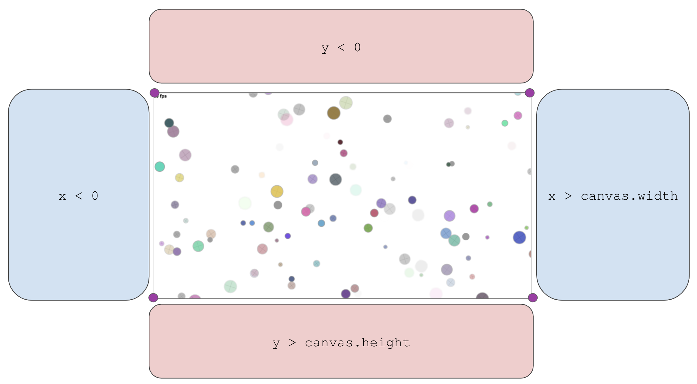

Circularity
===

A motion poem using random number generation and velocity applied to circles...

Also at: http://bit.ly/op-spark-circularity

**Table of Contents**


- [Prerequisites](#prerequisistes)
- [Installation](#installation)
- [Overview](#overview)
- [Loops To The Rescue](#loops-to-the-rescue)
	- [While Loops](#while-loops)
	- [For Loops](#for-loops)
	- [Arrays](#arrays)
	- [Iterating over Arrays](#Iterating-over-arrays)
- [Lesson Steps](#lesson-steps)
	- [TODO 1 : Declare Our Variables](#todo-1--declare-our-variables)
	- [TODO 2 : Create a function to draw a circle](#todo-2--create-a-function-to-draw-a-circle)
	- [TODO 3 : Draw 5 circles!](#todo-3--draw-5-circles)
	- [TODO 4 : Move your circles](#todo-4--move-your-circles)
	- [TODO 5 : Keep your circles in the screen](#todo-5--keep-your-circles-in-the-screen)
	- [TODO 6 : Take a break!](#todo-6--take-a-break)
	- [TODO 7 : Draw 100 circles](#todo-7--draw-100-circles)
	- [TODO 8 : Iterate over the array](#todo-8--Iterate-over-the-array)
	- [TODO 9 : Move all our circles and keep them all in bounds](#todo-9--move-all-our-circles-and-keep-them-all-in-bounds)

## Prerequisites
* Make sure your github account is linked to Greenlight
* You have a coding workspace. You can follow instructions found [here](https://github.com/OperationSpark/github-ide-setup/blob/master/README.md) to create an online coding workspace in Codenvy or offline using VS Code.
* You have the `os` tool installed. To verify if you have the `os` tool installed, go to the bash terminal in your coding workspace and type in the command: `os --version`. If you receive an error that says, `os install command not found` the opspark CLI is not installed. To install it, enter the command `npm intall -g opspark` in your bash terminal. When the installation is complete try `os --version` again.

## Installation
* go to your bash terminal and type in the command `os install`. Hit enter.
* If prompted, login with your github credentials
* Use your arrow keys to highlight your course and hit enter. hit enter again to confirm.
* Use your arrow keys to highlight `circularity` and hit enter. hit enter again to confirm.
* open up the index.html file and press Run at the top of your workspace. You will be editing this file.

## Overview

The portrait of the programmer as a young artist continues, using random number generation, color, and velocity applied to circles in this little motion poem. Using the draw line API, you'll create a cool randomized piece of art. 

Some concepts you'll practice and learn:
* Drawing with CreateJS and our draw utility.
* Leveraging the power of built-in and 3rd party API (DRY), like Math and opspark-draw.
* Variable declaration and initialization.
* Function invocation and passing arguments to functions.
* Looping.
* Conditional statements - making decisions in code.
* Recognizing code blocks.
* Calculating coordinates in a cartesian system.
* Calculating boundaries.
* Animating.

Note that **this app will run _in a web browser_**, preferably Chrome.

### Initializing Our App

Starting up an application often takes a few steps of:

* Importing some libraries of code.
* Loading some external data.
* Declaring and initializing some variables for use in our app.

We've setup the app a little bit already, importing some libraries and initializing the basic plumbing in the background, and we won't be loading any external data in our app, so let's move on to declaring, initializing and using our variables.

Our motion poem will contain 100 randomly drawn circles, arranged randomly within the area of our canvas.  The big takeaway in this project is **DRY**: Don't repeat yourself!

We want to draw 100 circles, but we don't want to write the code to do so 100 times.  That would be a silly waste of time and effort, making the code very difficult to maintain.

## Loops To The Rescue

Every programming language comes with features built-in to help you implement repetative processes, like looping over a list of data, or drawing a circle 100 times.  If we want to do anything more than once, we can use a _loop_, and is most often best practice to do so. 

Loops are a great tool to repeat a `{ code block }` a specific number of times and JavaScript comes with a number of built in loops, like `for`, `for-in`, and `while`. Additionally, many 3rd party libraries, like <a href="https://lodash.com/">_lodash_</a>, have implementations of other types of loops. We're going to use the `while` and `for` loops to accomplish our tasks for this project. 

To repeatedly execute some code using a loop, we answer 3 questions:

**1. What do we want to repeat?**

**2. What changes from loop to loop?**

**3. How long will the loop run?**

### While Loops
Let's start with a `while` loop. Suppose I wanted to print the messages `"pushups done: 1"`, `"pushups done: 2"`, and so on until a final message of `"pushups done: 10"`. To *hard-code* this, we could write:

```javascript
console.log("pushups done: 1");
console.log("pushups done: 2");
//... so on
console.log("pushups done: 10");
```

To do this using a loop we need answers to the 3 questions:

**What do we want to repeat?** `console.log()` a message about how many pushups we've done.

**What changes from loop to loop?** The number of pushups that we've done

**How long will the loop run?** Until we've done 10 pushups

Using a `while` loop, we can accomplish this in only 4 lines of code, rather than 10

````javascript
// use a Variable to keep track of how many pushups have been done
var pushupsDone = 1;

// Keep repeating while (as long as) pushupsDone is less than or equal to 10
while(pushupsDone <= 10) {

	// use the Variable `pushupsDone` instead of a hard coded Number
	console.log("pushups done: " + pushupsDone);	

	// increase `pushupsDone` after each repetition
	pushupsDone = pushupsDone + 1;						
}
````

How would you modify this loop so that it does `100` pushups instead of just `10`?

### For Loops
Another kind of loop we will use is the `for` loop. The for loops takes the components of a while loop pattern used in the previous example and condenses it into one line. To produce the same result as above using a `for` loop we could write:

````javascript
for(var pushupsDone = 1; pushupsDone <= 10; pushupsDone++) {
	console.log("pushups done: " + pushupsDone);	
}
````

After the keyword `for` are parentheses and curly braces which form a `{ code block }`. Like the `while` loop above, the `{ code block }` contains the code that we wish to repeat. The parentheses then takes the other three lines of code and lists them in the following order: 

* **Start** : `var pushupsDone = 1;`
	* Use the Variable `pushupsDone` to keep track of how many loops we've done.
* **Stop** : `pushupsDone <= 10`
	* Keep repeating while (as long as) `pushupsDone` is less than or equal to `10`
* **Update** : `pushupsDone++;`
	* increase `pushupsDone` *after* each repetition.
	* `pushupsDone++;` is shorthand for `pushupsDone = pushupsDone + 1;`, and you'll see the `++` or `--` operators used often in code to accomplish this type of pattern.

### Arrays

For-loops also provide a convenient way to access elements of an Array one at a time. Arrays are *zero-indexed* lists of data. Basically, an Array acts as a container, into which we can throw objects, like strings, numbers, or circles. We call the things we throw into Arrays, _items_ or _elements_, as in, the _elements_ of our Array. Arrays are contained within square brackets `[ ]` and are stored in variables.

````javascript
var friends = ['John', 'Max', 'George', 'Ben', 'Steve', 'Brian'];
````

To retrieve an individual _element_ from an Array, we can use *Bracket Notation* which looks like this:

```javascript
arrayName[index] 	// Bracket Notation
```

The `index` is a value's position in the Array. The first value's position is `0`, not `1`. So, we can access the elements of the `friends` Array like so:

````javascript
friends[0];			// returns "John"
friends[1];			// returns "Max"
// so on...
friends[friends.length-1];	// returns "Brian". 
````

The `index` for the final line of code is calculated using the `friends.length` property which always returns the number of elements in the Array, in this case `6`. Therefore, this calculated index is `6 - 1 === 5`. 

**Starting at `0`, count the indexes for the value of the `friends` Array and confirm that the last index is in fact `5`.**

### Iterating over Arrays

Suppose I wanted to print out a message saying `"Hello John"`, `"Hello Max"` and so on with _every_ value in the array. I could hard code this by writing:

```javascript
console.log("Hello " + friends[0]);	// "Hello John"
console.log("Hello " + friends[1]);	// "Hello Max"
// so on...
console.log("Hello " + friends[friends.length-1]);	// "Hello Brian"
```

But this is very repetitive. Using loops we can accomplish the same result. First, we must answer the 3 questions:

**What do we want to repeat?** `console.log()` a message saying `"Hello"` to each name in the `friends` Array

**What changes from loop to loop?** The Numbered `index` used in Bracket Notation which changes the name we are accessing from the `friends` Array

**How long will the loop run?** Until we've said `"Hello"` to every name in the `friends` Array.

Using a `while` loop, the solution would then look like this:

````javascript
// use a Variable to keep track of the friend index we are accessing. The first index is 0
var friendIndex = 0;

// Keep repeating while (as long as) index is less than or equal to the last index of the Array, calculated using the friends.length property
while(friendIndex <= friends.length - 1) {

	// use the Variable `friendIndex` instead of a hard coded Number
	console.log("Hello " + friends[friendIndex]);

	// increase `friendIndex` after each repetition
	friendIndex++;						
}
````

This is called *iterating*. Iterating is the process of accessing values of an Array using a loop. This works by using the counter variable of a for loop (often named `i` - short for index) as a placeholder for the numbered index we want to access. Achieving the same result using a `for` loop would look like this:

````javascript
for (var i = 0; i <= friends.length - 1; i++) {
    console.log("Hello " + friends[i]);
}
````

***

# Lesson Steps

## Run the program
Open the `index.html` file and follow the instructions below to run your program:
- **Cloud9**: at the top of your window, click the **Preview** button. Then, in the top right corner of the preview window, click **Pop Out Into New Window**
- **Codenvy**: right click on the `index.html` file in your file system and click **Preview**


# TODO 1 : Declare Our Variables

Start by opening the `js/init.js` file. We will do all our coding in this file. 

**FND:** The `PROGRAM SETUP` section of the program. `TODO 1` will be below.

The goal of this project is to create 100 animated circles. Before we get ahead of ourselves, let's create one circle. Declare a variable to hold that circle (we will deal with initializing it later). Also we want to create an empty array to hold our circles, more on that later:

**CODE:** Under **TODO 1**, declare 2 variables: `circle` and `circles`

````javascript
// TODO 1: Declare our variables //
var circle;			// variable to hold a single circle when creating circles / iterating
var circles = [];	// variable to store all circles in one Array
````


# TODO 2 : Create a function to draw a circle

We will want to draw many circles in this project so putting the code to draw one circle inside a **function** will make the code much more re-usable! We've created a variable for you called `drawCircle` to hold our function. 

**FIND:** The `PROGRAM SETUP` Section and `// TODO: 2`

**CODE:** Declare a Function `drawCircle`. It should have no Parameters. When called, it should execute the sequence below:

````javascript
// Code to draw a circle
circle = draw.randomCircleInArea(canvas, true, true, '#999', 2);
physikz.addRandomVelocity(circle, canvas);
view.addChild(circle);
circles.push(circle);

````

## What does this code actually do?

First we call a function from the `draw` library: a collection of functions that allow us to draw various shapes on our `canvas`. This method, `draw.randomCircleInArea` will draw a circle of random size, color, and location within the screen along with a few other settings. Check out the parameters of the function below:

    randomCircleInArea(area, randomizeAlpha, addCross, borderColor, borderThickness, randomRadialProps)
    
We temporarily store the output of the function in `circle`. We then use the `physikz` library, a library of functions that provide motion to canvas drawings, to add a random velocity and direction to our circle.

To get the circle to appear on the screen we add the circle as a *child* of `view` (Think of the parent <-> child relationship of HTML elements!).

Lastly we save each new circle in an array using the `.push()` method. Doing so keeps all circles that we make together in one location which will be very useful very soon!


# TODO 3 : Draw 5 circles!

**FIND:** The `PROGRAM SETUP` Section and `// TODO: 3 / 7`

**CODE:** Call your new `drawCircle` Function 5 times:

```js
// TODO 3 / 7 : Call the drawCircle() function 

/* Your Function Calls HERE */
```

**HINT:** You can make a **Function Call** using the following syntax:

```javascript
nameOfFunction();
```

## Save your code, Refresh your game

For now, by copying and pasting these function calls we are violating the **DRY Rule: D**ont **R**epeat **Y**ourself. Keep this in mind as we move on. We'll find a better way to do this!


# TODO 4 : Move your circles

Awesome, let's do some fun stuff with our circles now.  

**FIND:** The `function update()` where we will write code to animate our circles. 

Remember that the `update()` Function is called 60 times per second (also referred to as 60 ticks/frames per second), and on each new frame we want to move our circles slightly.

The `physikz.updatePosition( circle )` Function which accepts a circle as an argument will redraw that circle in a new location!

Since our circles are all stored in the `circles` **Array** we must use _Bracket Notation_ to pull out each individual circle to be moved. Bracket Notation includes the **Index** of the value that we want to pull out of the Array. The first value in the Array has an index of `0`, the next has an index of `1`, and so on.

```javascript
myArray[0] //--> returns the first value in myArray
myArray[1] //--> returns the second value in myArray
```

**CODE:** Call the `physikz.updatePosition()` Function and pass in the **first circle** in the `circles` Array. Then, do the same with the other 4 circles. Your code should look like this

```javascript
function update() {
	// TODO 4 : Update the circle's position //

	physikz.updatePosition( /* Your Bracket Notation HERE */ );
	physikz.updatePosition( /* Your Bracket Notation HERE */ );
	physikz.updatePosition( /* Your Bracket Notation HERE */ );
	physikz.updatePosition( /* Your Bracket Notation HERE */ );
	physikz.updatePosition( /* Your Bracket Notation HERE */ );
}
```

# TODO 5 : Keep your circles in the screen 

This TODO has 2 steps. Make sure to complete them all before moving on.

## Step 1) Call `game.checkCirclePosition` on each of your circles

The incomplete Function `game.checkCirclePosition()`, when called, is meant to keep circles that stray off the screen on the screen. 

**FIND:** The `update` Function and `// TODO 5`

**CODE:** Call the `game.checkCirclePosition()` Function and pass in the **first circle** in the `circles` Array. Then, do the same with the other 4 circles. Your code should look like this

```javascript
// TODO 5 : Call game.checkCirclePosition() on your circles.

game.checkCirclePosition( /* Your Bracket Notation HERE */ );
game.checkCirclePosition( /* Your Bracket Notation HERE */ );
game.checkCirclePosition( /* Your Bracket Notation HERE */ );
game.checkCirclePosition( /* Your Bracket Notation HERE */ );
game.checkCirclePosition( /* Your Bracket Notation HERE */ );
```

**Save your code and refresh your program.**

At this point you'll notice that the circles only come back if they exit through the right side of the screen. In the next part, we'll fix this.

## Step 2: Complete the `game.checkCirclePosition()` Function

**FIND:** The Function Declaration for `game.checkCirclePosition()`. Currently, it should contain this code:

````javascript
if (circle.x > canvas.width) {
	circle.x = 0;
}
````

**The Circle**

Each `circle` has 2 properties: `circle.x` and `circle.y`
- `circle.x` is the current position of the circle along the x-axis.
- `circle.y` is the current position of the circle along the y-axis. 

**The Canvas**

The `canvas` represents the blank screen and allows us to add drawings to it. The canvas has 2 very important *properties*:
- `canvas.width` is the maximum x-coordinate on the screen.
- `canvas.height` is the maximum y-coordinate on the screen.

The minimum x and y coordinates are `0` and `0`. This is called the origin, where the x-axis and y-axis intersect at 0, and is always located in the top left corner of the browser window. 



Since `canvas.width` is the **Maximum** x-coordinate on the screen, if `circle.x` is greater than that value, then we know the box has drifted past the right side of the screen.

`circle.x = 0` re-assigns the x-coordinate of the circle to `0`, placing it on the left side - opposite of where the box left the screen!

The Function is incomplete however. It only keeps circles that exit the right side on the screen! 

**CODE:** Add additional `if` statements to check the other three sides of the screen. Your Function should look like this:

```js
game.checkCirclePosition = function(circle) {

	// if the circle has gone past the RIGHT side of the screen then place it on the LEFT
	if ( circle.x > canvas.width ) {
		circle.x = 0;
	}
	
	// TODO 5 : YOUR CODE STARTS HERE //////////////////////
	
	/* Your conditional statements HERE */

	// YOUR TODO 5 CODE ENDS HERE //////////////////////////
}
```


**CHALLENGE:** The circle is centered around its own `x` and `y` position. To find the outer right edge of the circle, we can use the `circle.radius` property like so:

```javascript
var rightEdge = circle.x + circle.radius;
```

Use the `circle.radius` property to calculate the four edges of the circle to make the  circle more smoothly exit and enter the screen!

# TODO 6 : Take a break!

Congrats! You have made a beautiful program that creates 5 circles, animates them, and keeps them within the screen. Take a 10 minute break from coding and reflect on the code that you have just written. Do you understand what each component does? 

When writing large programs it is a good practice to start small and work your way up to the full program. So far we have been able to create 5 circles, move them, and keep them in our screen's view. But what if we wanted our program to run with 100 circles? 

# TODO 7 : Draw 100 circles

A loop should do the job! 

**FIND:** `// TODO 3 / 7` and your repetitive calls to `drawCircle()`.

**CODE:** Replace your repetitive code with a loop (either a `while` or a `for` loop) that will call the `drawCircle()` Function 100 times.

**HINT:** Here is the basic outline of a while loop that runs 10 times...

```javascript
var loopsCompleted = 0; 
while (loopsCompleted < 10) {
    // do something
    loopsCompleted++
}
```

...and a for loop that runs 10 times:

```js
for (var loopsCompleted = 0; loopsCompleted < 10; loopsCompleted++) {
    // do something
}
```

# TODO 8 : Iterate over the array

Now that we have 100 circles, we need a way to move all 100 circles and keep all 100 circles within the screen without calling on each circle individually. **Iterating** is the way to go!

Iteration is the process of accessing every element in an array and performing some action with that element. 

To help iterate, we want to answer the following questions:
1. What are you trying to repeat?
2. What needs to change from loop to loop?
3. How long will the loop run?

In our case, we want to access every `circle` from our `circles` array and apply the `physikz.updatePosition(circle)` function on each circle. The circle is that we call the Function with changes from loop to loop. We will loop until every circle has been called on!

To iterate we can follow this pattern

```javascript
for (var i = 0; i < myArray.length; i++) {
    var eachValue = myArray[i];
    
    // code to repeat using eachValue
}
```
How can we apply this pattern to our `circles` array? What code do we want to execute for each value?

**FIND:** The `update` Function, below **TODO 8**

**CODE:** Follow the pattern above and create a loop that will iterate over the `circles` array and create a variable `var eachCircle` for each circle in the Array. 

# TODO 9 : Move all our circles and keep them all in bounds

Awesome job! Now that we have our loop in place and we are iterating over our `circles` Array, let's use the `circle` that we pull out on each loop to do some cool stuff!

1. Within the loop that you just created, call the `physikz.updatePosition(eachCircle)` function.
2. Then, call the `game.checkCirclePosition(eachCircle)` function.
3. Delete your calls to those functions from **TODO 4** and **TODO 5**
4. Sit back and relax

Congrats!

&copy; Operation Spark 2015
